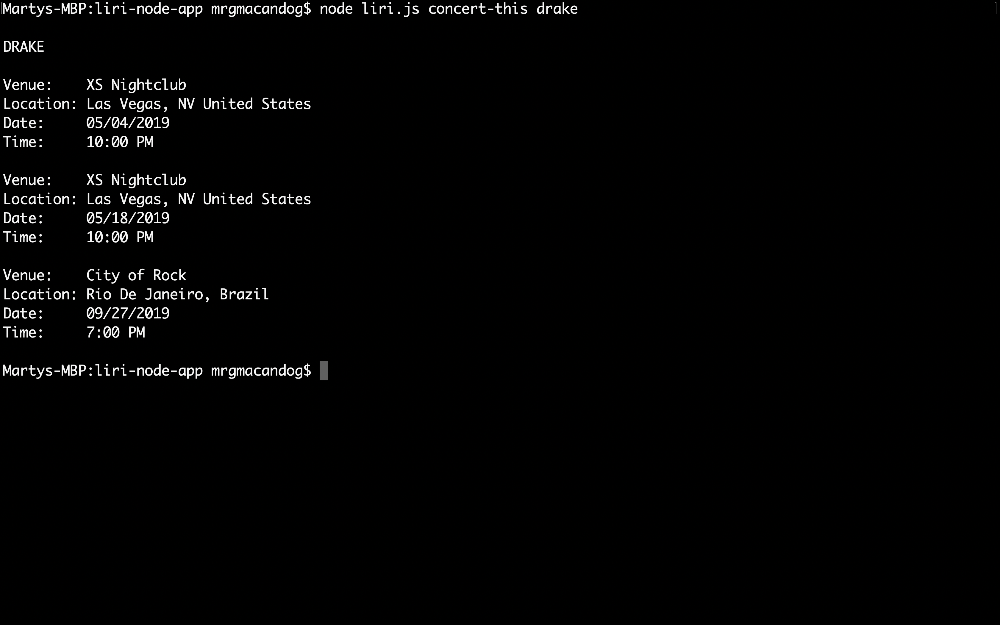
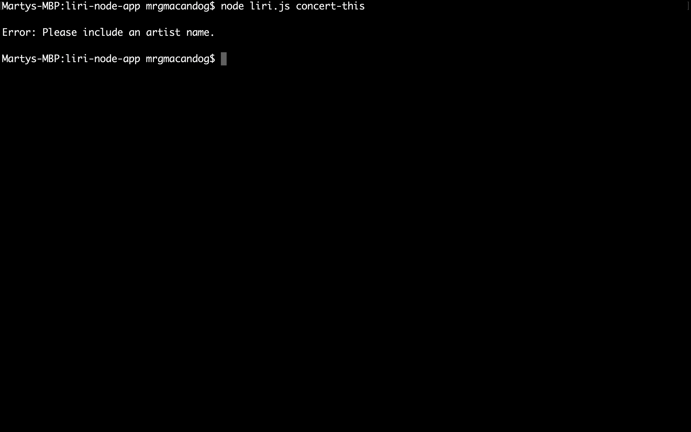
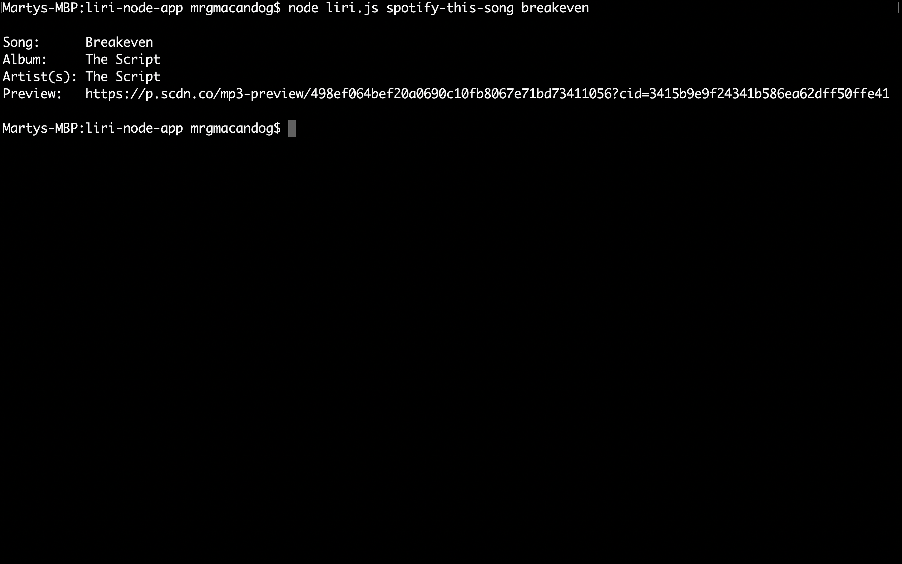
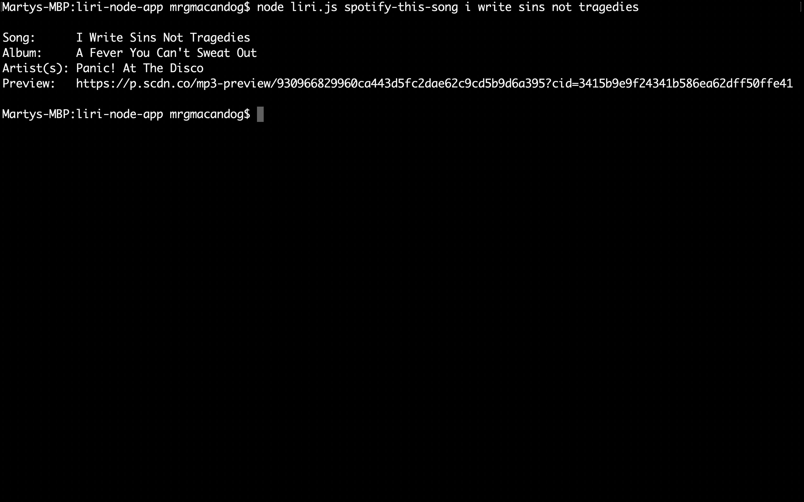
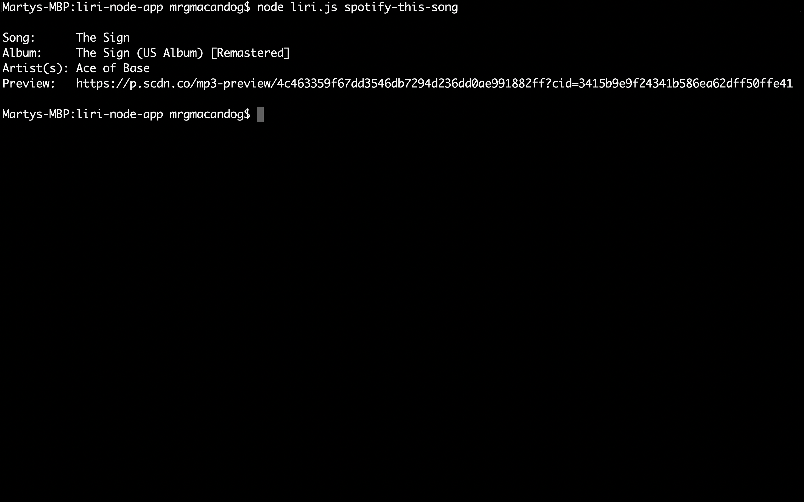
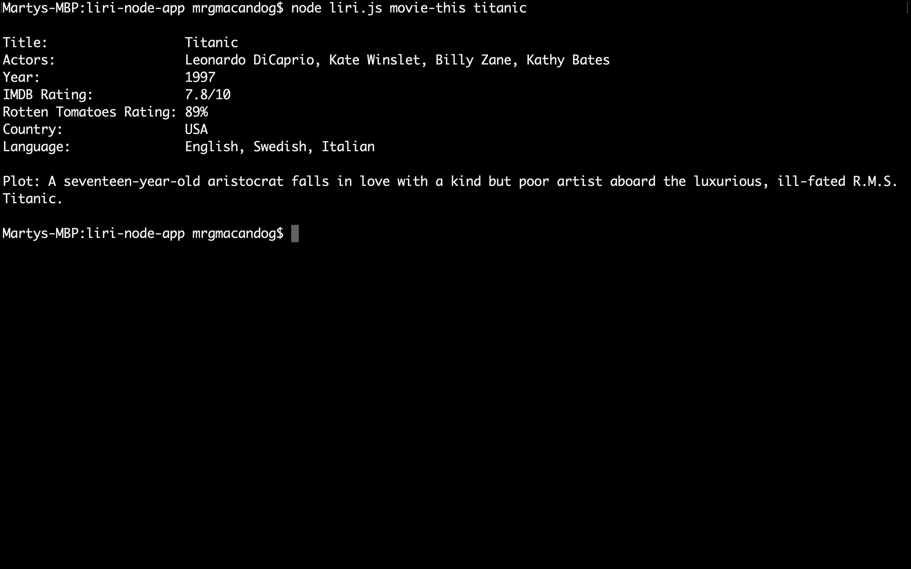
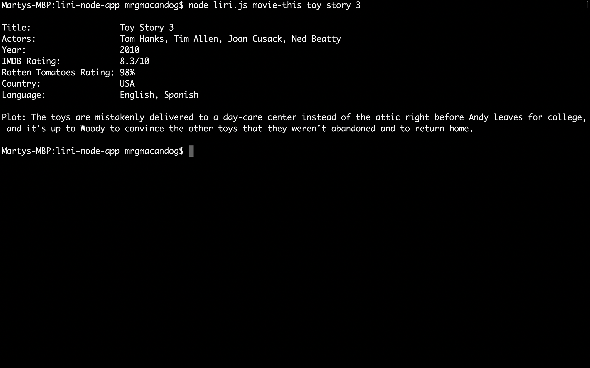
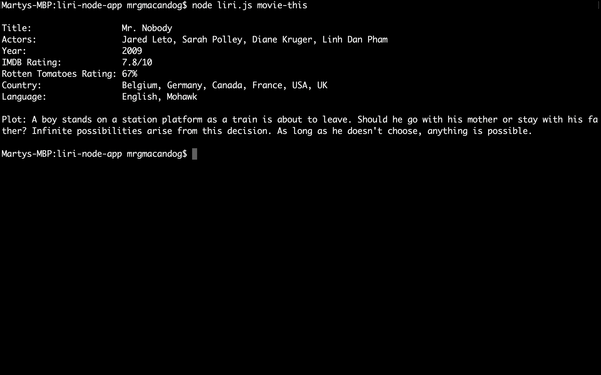
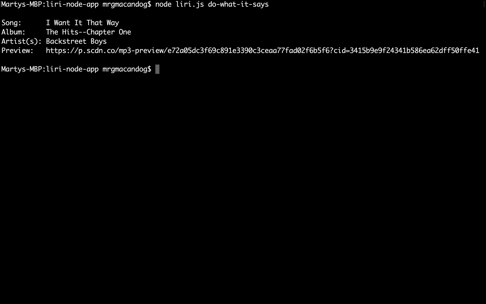
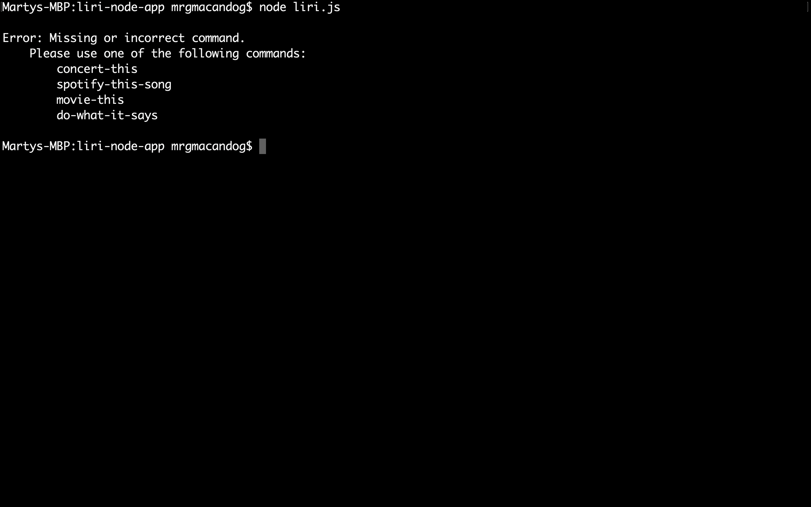

# LIRI Node App
This CLI app allows users to get event information for an artist, information for a song, or information for a movie.

---

## Commands

| Command Name        | Search Query          | Default Search Query | Description |
| ------------------- | --------------------- | ---------------------| ----------- |
| `concert-this`      | Artist name           | None                 | Gets the venue name, location, date, and time for each event the artist is performing at. |
| `spotify-this-song` | Song name (optional)  | The Sign             | Gets the song name, album, artist(s), and link to a preview of the song. |
| `movie-this`        | Movie name (optional) | Mr. Nobody           | Gets the movie name, actor(s), year released, IMDB rating (if available), Rotten Tomatoes Rating (if available), country, and language(s). |
| `do-what-it-says`   | None                  | None                 | Gets input from `random.txt` and does the command it matches above. |


---

## Command Instructions

### Using `concert-this`

To get the event details for an artist, use the `concert-this` command followed by the artist name.

#### Examples:
1. `node liri.js concert-this drake`


2. `node liri.js concert-this big sean`

Note that the command also works with artists with mutiple names.

3. `node liri.js concert-this`

If an artist isn't incluced, the error above is thrown.


### Using `spotify-this-song`

To get information regarding a song, use the `spotify-this-song` command followed by an optional song name.

#### Examples:
1. `node liri.js spotify-this-song breakeven`


2. `node liri.js spotify-this-song i write sins not tragedies`

Note that the command also works with songs with mutiple names.

3. `node liri.js spotify-this-song`

If a song isn't included, it defaults to The Sign by Ace of Base.


### Using `movie-this`

To get information regarding a movie, use the `movie-this` command followed by an optional movie name.

#### Examples:
1. `node liri.js movie-this titanic`


2. `node liri.js movie-this toy story 3`

Note that the command also works with movies with mutiple names.

3. `node liri.js movie-this`

If a movie isn't included, it defaults to Mr. Nobody.


### Using `do-what-it-says`

The command `do-what-it-says` does not take a search query, it performs the command (before the comma) in `random.txt` using the search query (after the comma).

#### Example:
Contents of random.txt:
```
spotify-this-song,"I Want it That Way"
```

`node liri.js do-what-it-says`



### Using liri.js without a command

`node liri.js`

If a command is not included, the user is instructed to use a command from the list provided.

---

## Implementation

### Node
- Running JavaScript on the server
- Creating a CLI app
- Ability to use code snippets from other packages

### Package Dependencies

| Package | Purpose |
| ------- | ------- |
| [DotEnv](https://www.npmjs.com/package/dotenv) | To set private keys (Spotify API keys) |
| [Axios](https://www.npmjs.com/package/axios) | Perform AJAX requests to APIs |
| [Moment](https://www.npmjs.com/package/moment) | Parse and display dates and times |
| [Node-Spotify-API](https://www.npmjs.com/package/node-spotify-api) | Wrapper that handles AJAX requests to the Spotify API |

### APIs

| API | Data Used |
| --- | --------- |
| [Bands In Town](http://www.artists.bandsintown.com/bandsintown-api) | Artist Events |
| [Spotify](https://developer.spotify.com/) | Songs |
| [OMDB](http://www.omdbapi.com) | Movies |

---

## Notes

### Install Package Dependencies
Before using the app, you must install all package dependencies using the node command `npm install`.

### .env
You will need to create your own .env file that `keys.js` will use. It should include your Spotify ID and Secret ID without any quotes and look like the following:
```
# Spotify API keys

SPOTIFY_ID=your-spotify-id
SPOTIFY_SECRET=your-spotify-secret
```

To get a Spotify API key, please log in to their [website](https://developer.spotify.com/my-applications/#!/applications/create) and create a client ID.